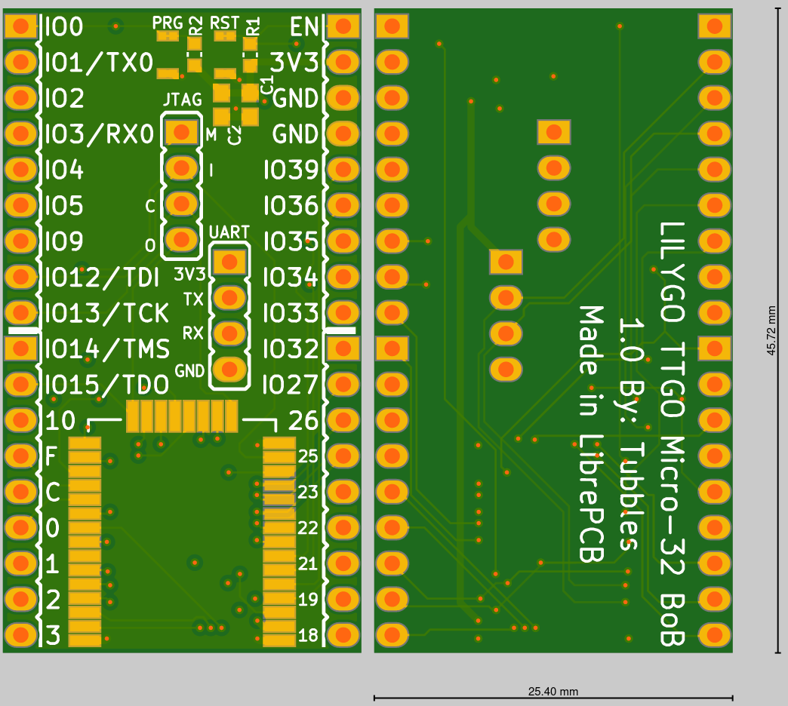

# ttgo_bob

## Description

Breakout board for the positively tiny ESP32 board [TTGO Micro-32 from LILYGO](http://www.lilygo.cn/prod_view.aspx?Id=1091).

## License

See [LICENSE.txt](LICENSE.txt).
